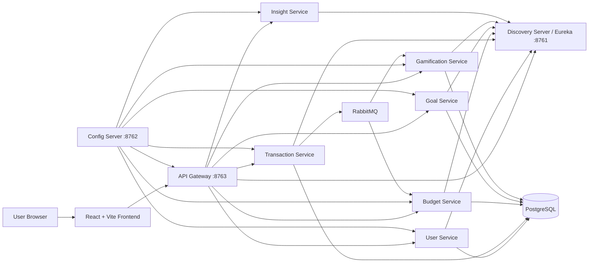

# BudgetQuest Architecture

## Request Flow

1. The browser loads the React frontend.
2. The frontend sends API requests to the API Gateway.
3. The API Gateway routes requests to the correct backend service.
4. Backend services register themselves with Eureka.
5. Backend services read shared configuration from Config Server.
6. Transaction Service publishes events after transaction create, update, and
   delete operations.
7. Budget Service consumes transaction events and updates monthly/yearly
   summaries.
8. Gamification Service consumes transaction events and updates XP, levels,
   badges, and streaks.
9. Insight Service loads dashboard context and returns mock educational
   coaching.

## Ownership Boundaries

Each service owns one part of the business model:

| Service | Owns |
| --- | --- |
| User Service | Profile and preferences |
| Transaction Service | Income and expense records |
| Budget Service | Budget summaries and calculated totals |
| Goal Service | Financial goals |
| Gamification Service | XP, levels, badges, streaks |
| Insight Service | Coaching message generation |

## Important Design Idea

Transaction Service owns the real transaction data. Budget Service and
Gamification Service do not directly own transactions. They keep their own
read models by reacting to transaction events.

That is why event payloads matter. For example, when a transaction is updated,
Budget Service needs both the old transaction values and the new transaction
values so it can subtract the previous amount and add the new amount.

## Why Eureka And Config Server Exist

Eureka answers: "Where is this service running?"

Config Server answers: "What configuration should this service use?"

Together, they make the services easier to start, route, and configure as a
group.
